# 🐬 Mermaid Cheatsheet & Examples

A quick reference to learn **Mermaid diagrams** inside Markdown.

---

## 1. Flowchart Basics

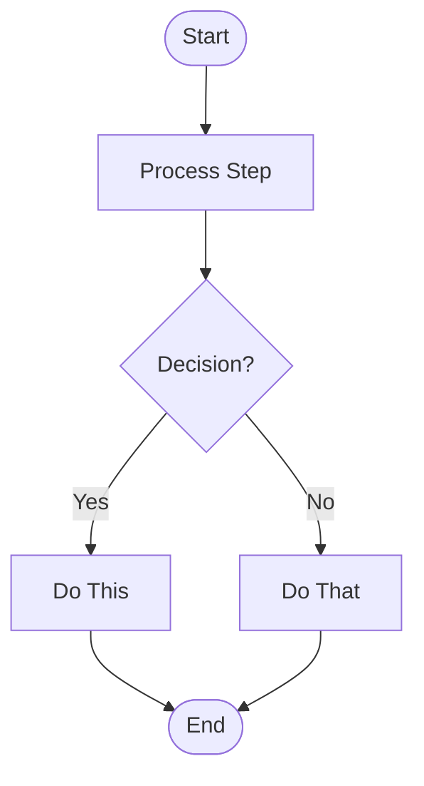

### Explanation:
- `TD` → Top-to-Down layout (can also use `LR`, `BT`, `RL`).
- `()` → Rounded rectangle (terminator).
- `[]` → Rectangle (process).
- `{}` → Diamond (decision).

--- 

## 2. Arrow Types

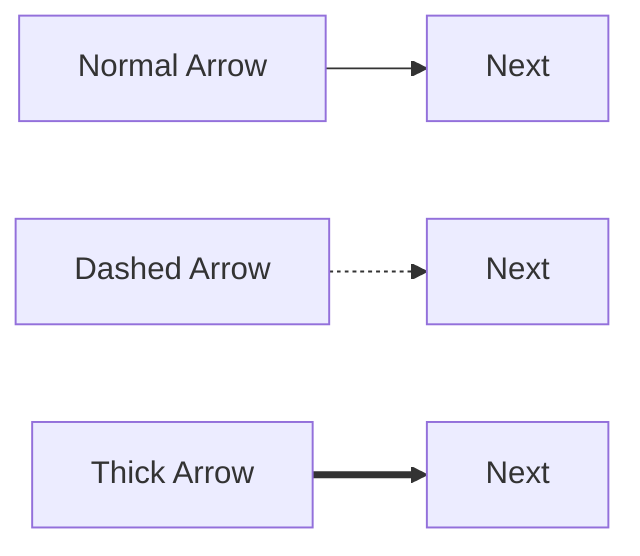

---

## 3. Node Shapes

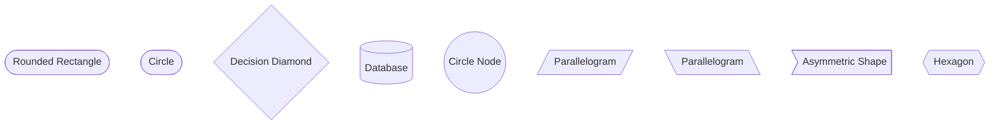

---

## 4. Coloring & Classes

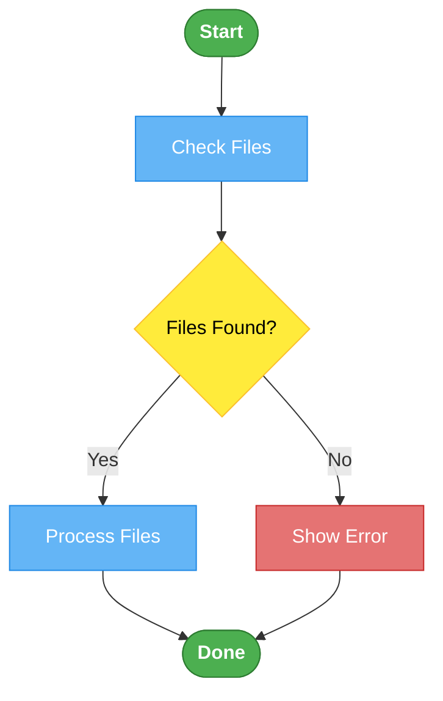

---

## 5. Subgraphs (Grouping)

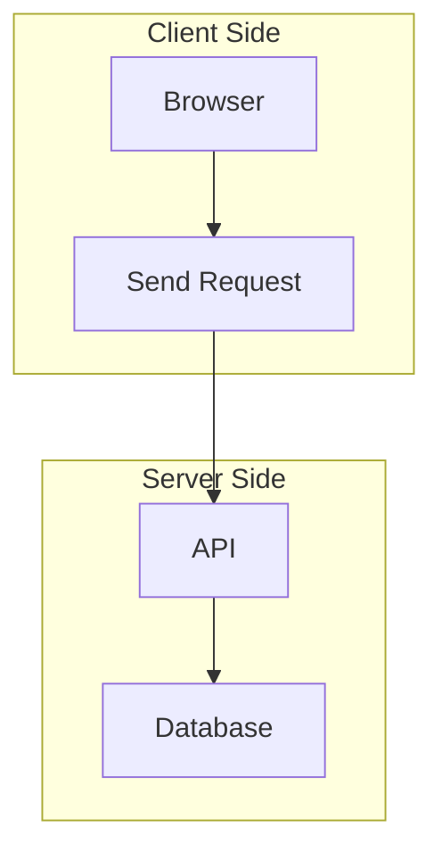

--

## 6. Sequence Diagrams

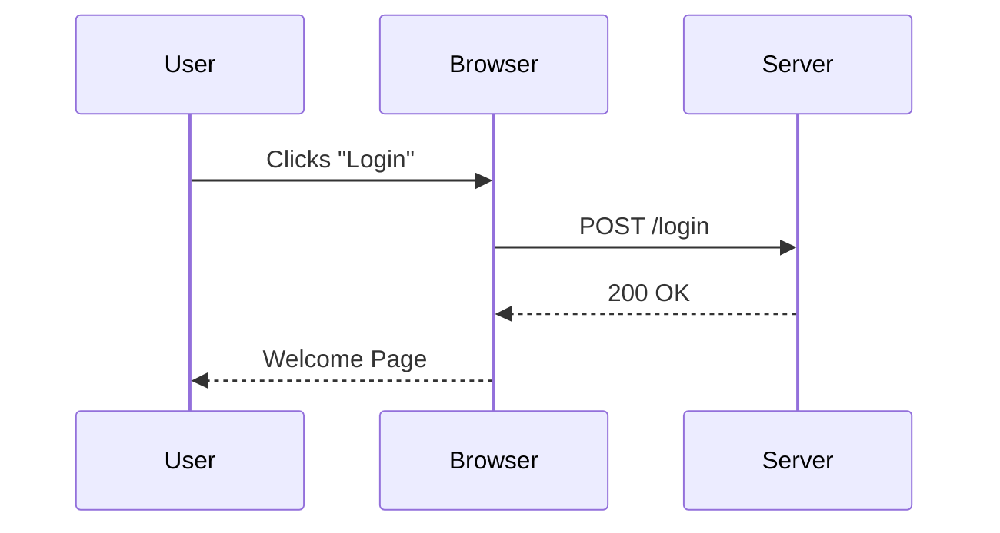

---

## 7. Class Diagram (UML Style)

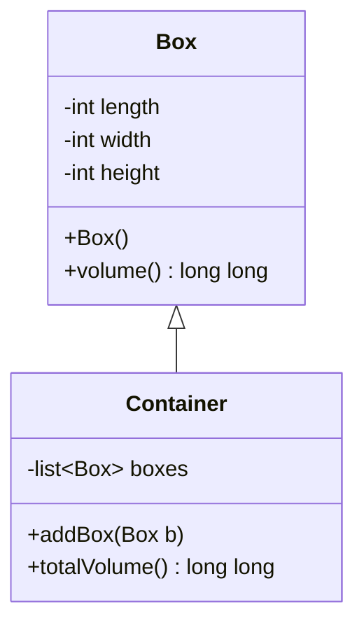

---

## 8. State Diagram

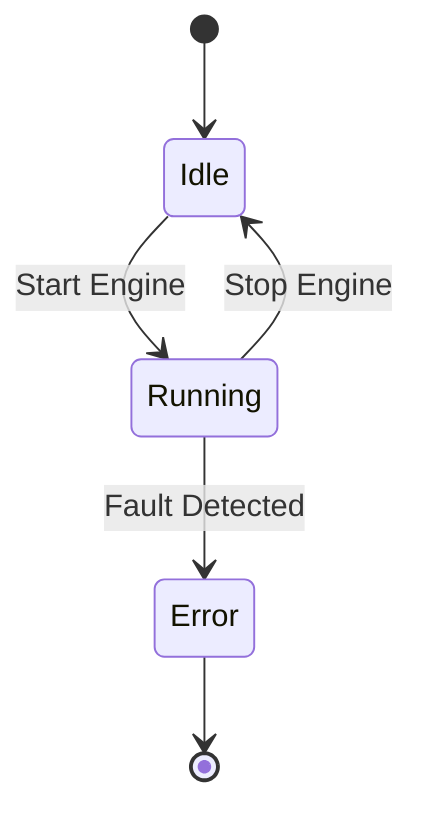

---

## 9. Gantt Chart (Timelines)

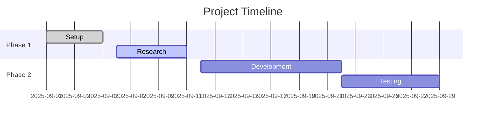

---

## 10. Pie Chart

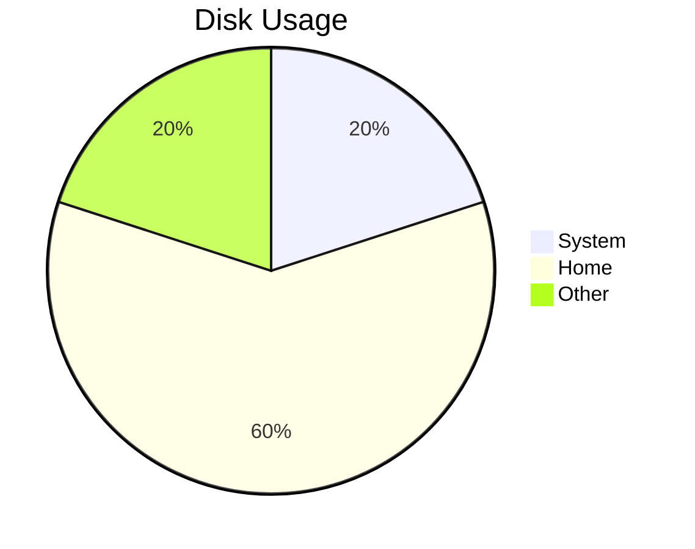

---

## 11. Cheatsheet Table

| Shape Syntax | Shape               |
| ------------ | ------------------- |
| `[Text]`     | Rectangle (Process) |
| `(Text)`     | Rounded Rectangle   |
| `{Text}`     | Diamond (Decision)  |
| `((Text))`   | Circle              |
| `((Text))`   | Circle              |
| `[/Text/]`   | Parallelogram (I/O) |
| `[[Text]]`   | Subroutine          |
| `((Text))`   | Circle Terminator   |
| `-->`        | Normal Arrow        |
| `-.->`       | Dashed Arrow        |
| `==>`        | Thick Arrow         |

---

## ✅ Tips

- Use `classDef` to style multiple nodes consistently.
- Use `subgraph` to organize sections.
- Escape special symbols with `\` if they break syntax (`\~`, `\$USER`).
- Use quotes for multi-line labels: `["Line1 Line2"]`.

---

# Mermaid Diagrams Detailed Learning (One Paragraph)

- ### Mermaid is a powerful tool to create diagrams in Markdown using a simple text syntax, and it supports many diagram types such as 
    - **flowcharts**, 
    - **sequence diagrams**, 
    - **class diagrams**, 
    - **state diagrams**, 
    - **entity-relationship (ER) diagrams**, 
    - **journey diagrams**, and 
    - **Gantt charts**. 
- ### For example, 
    - in **`flowcharts`** 
        - you can define the direction (`TD` for top-down, `LR` for  left-right), 
        - nodes with different shapes like 
            - rectangles `[Process]`, 
            - circles `((Terminator))`, 
            - diamonds `{Decision}`, 
            - subroutines `[[Subroutine]]`, and 
        - links using arrows 
            - `-->` (normal arrow), 
            - `-.->` (dashed arrow), 
            - `==>` (thick arrow). 
        - You can also add **styles** with `classDef` to color nodes (`fill`, `stroke`, `color`, `font-weight`) and then apply them with `class`. 
        - For instance: 

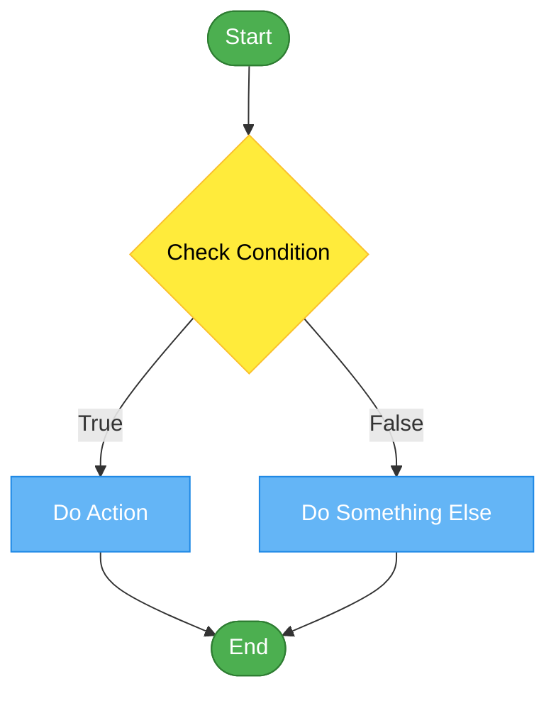
- This example shows different shapes and colors to make a readable workflow. 

--- 

- ### Another type is the **`sequence diagram`**, which shows interactions between participants over time, for example: 

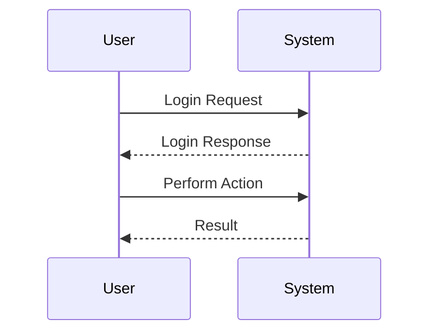

- Here `->>` means a solid line with an arrow, 
- while `-->>` means a dashed line response. 

---

- ### For **`class diagrams`**, you can model objects like in **`UML`**: 

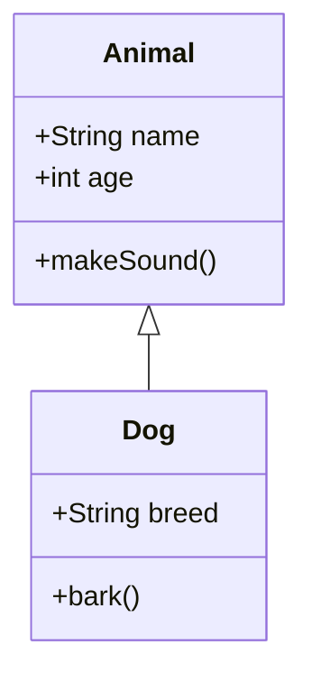
- This shows `Dog` inherits from `Animal`. 

---

- ### In **`state diagrams`**, you can represent transitions: 

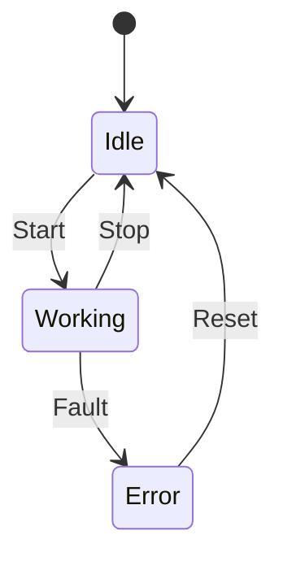
- The `[ * ]` means the initial state. 

---

- ### You can also make **`ER diagrams`** for databases: 

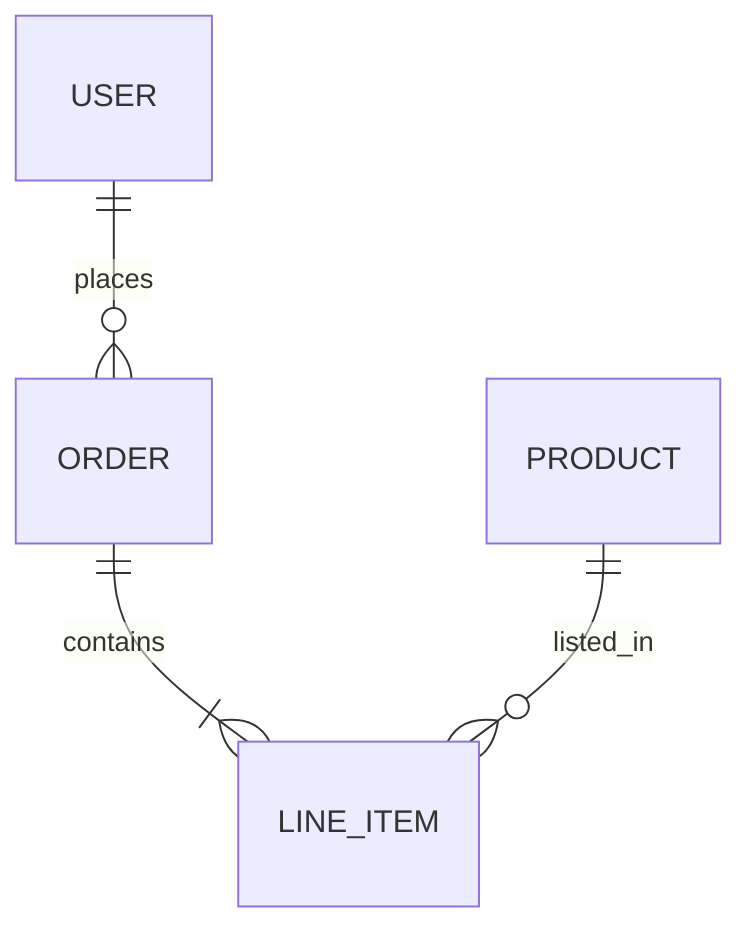
- This shows relationships between tables. 

---

- ### For project planning, **`Gantt charts`** are supported: 

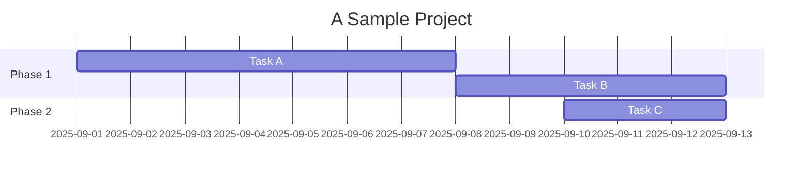
- which visualizes tasks and timelines. 

---

- ### Mermaid also supports **`journey diagrams`** (good for user experience flow): 
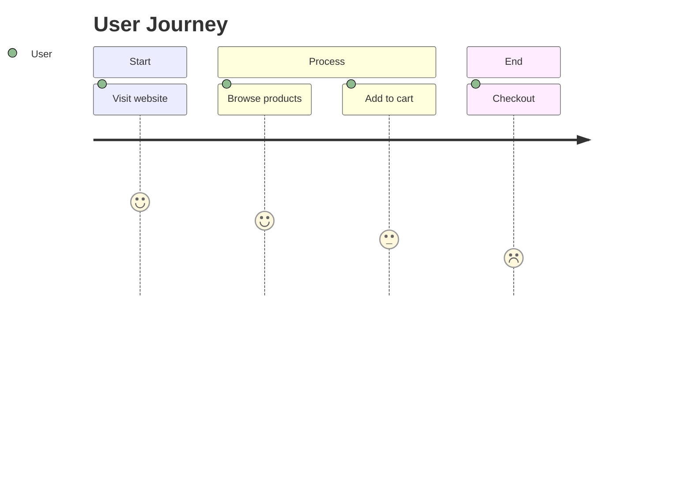
- where numbers represent satisfaction levels. 

--- 

- ### In all these, you can enrich diagrams with **`styling and classes`**. 
    - For example, you can color:
        - decision nodes `yellow`, 
        - processes `blue`, 
        - start/end `green`, and 
        - risky actions `red` 
    - by defining **`classDef`** and assigning them. 
    
- ### Mermaid diagrams are inline code blocks fenced with triple backticks and `mermaid`, and they are rendered automatically in many Markdown environments (like `GitHub`, `GitLab`, `Obsidian`, `MkDocs`, and `VSCode extensions`). 

- ### By combining `shapes`, `arrows`, `styles`, and `diagram types`, 

- ### you can express **`workflows`**, **`system designs`**, **`database schemas`**, **`timelines`**, and **`interactions`** all in Markdown ***`without external drawing tools`***,  making documentation reproducible, version-controlled, and easy to maintain.