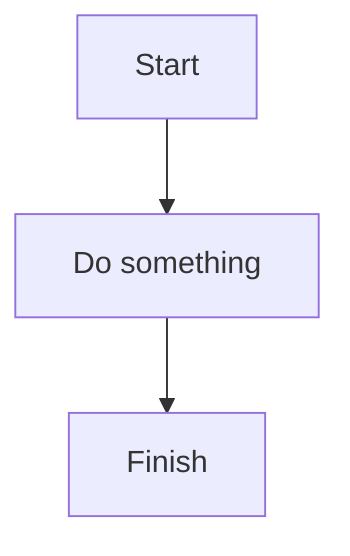
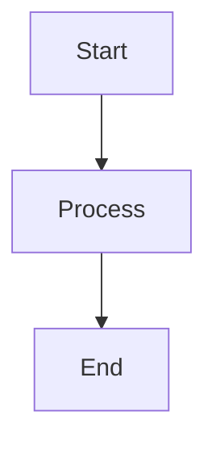
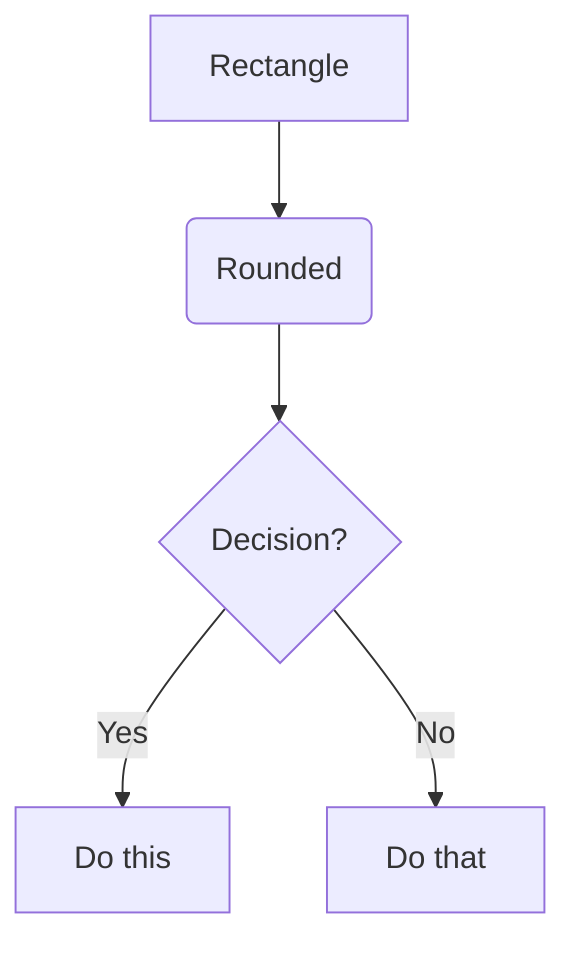
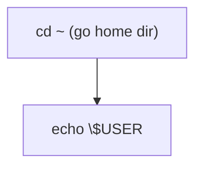
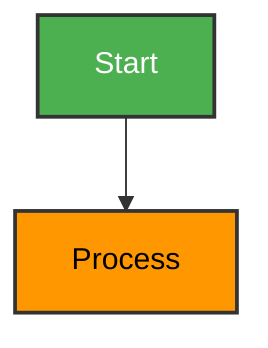
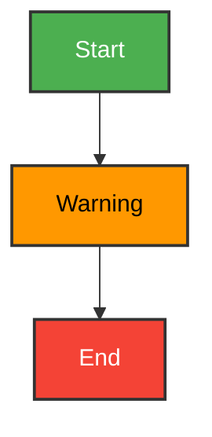

```mermaid
flowchart TD
    A[Start] --> B[Check Mountpoint Directory]
    B -->|Doesn't exist| C[Create Directory with mkdir -p]
    B -->|Exists| D[Skip Creation]

    C --> E[Mount /dev/sda1]
    D --> E

    E --> F[Verify with df -h]
    F --> G[Copy Folders with rsync -avh --progress]
    G --> H[Confirm Copy Complete]
    H --> I[Check if inside $MOUNTPOINT]
    I -->|Yes| J["cd ~ (go home dir)"]
    I -->|No| K[Proceed]
    J --> K

    K --> L[Check Processes with lsof]
    L --> M[Unmount with udisksctl unmount -b /dev/sda1]
    M --> N[Power off with udisksctl power-off -b /dev/sda]
    N --> O[Safe to Remove Drive ✅]
```

```mermaid
flowchart TD
    A([Start]) --> B{Check Mountpoint Directory}
    B -->|Doesn't exist| C[Create Directory with mkdir -p]
    B -->|Exists| D[Skip Creation]

    C --> E[Mount /dev/sda1]
    D --> E

    E --> F[/Verify with df -h/]
    F --> G[Copy Folders with rsync -avh --progress]
    G --> H[Confirm Copy Complete]
    H --> I{Check if inside $MOUNTPOINT}
    I -->|Yes| J["cd ~ (go home dir)"]
    I -->|No| K[Proceed]
    J --> K

    K --> L[Check Processes with lsof]
    L --> M[Unmount with udisksctl unmount -b /dev/sda1]
    M --> N[Power off with udisksctl power-off -b /dev/sda]
    N --> O([Safe to Remove Drive ✅])

    %% ----- Style Definitions -----
    classDef startEnd fill:#4CAF50,stroke:#2E7D32,color:#fff,font-weight:bold;
    classDef decision fill:#FFEB3B,stroke:#FBC02D,color:#000;
    classDef process fill:#64B5F6,stroke:#1E88E5,color:#fff;
    classDef verify fill:#81C784,stroke:#388E3C,color:#fff;
    classDef warning fill:#E57373,stroke:#C62828,color:#fff;

    %% ----- Assign Styles -----
    class A,O startEnd;
    class B,I decision;
    class C,D,E,G,H,J,K,L,M,N process;
    class F verify;
```

# 📘 Mermaid Diagrams in Markdown

Mermaid lets you **draw diagrams** directly in Markdown files using a special code block:

---

## 1. Basic Flowchart

- `flowchart TD` → means flowchart **`Top → Down`** 
    - ***other options:***
        - `LR` → **`left→right`**, 
        - `RL` → **`right→left`**, 
        - `BT` → **`bottom→top`**.
- `A[Text]` → defines a node named `A` with label `Text`.
- `A --> B` → arrow from `A` to `B`.

---

## 2. Node Shapes

- `[Text]`* → **`Rectangle`**
- `(Text)` → **`Rounded`**
- `{Text}` → **`Diamond (decision**)`**
- `((Text))` → **`Circle`**
- `[/Text/]` → **`Parallelogram (input/output)`**

---

## 3. Escaping Special Characters

### Some symbols (**`~`**, **`|`**, **`{}`**, **`()`**) may break Mermaid parsing.
✅ Fix → wrap in quotes **`" "`** or escape with **`\`**.

Example:

---

## 4. Adding Colors 🎨

You can **`style nodes`** using **`style`** or define **`classes`**.

### **a) Style individual nodes**

### **b) Define reusable classes**

---

## 5. Full Example: Copy Workflow

```mermaid
flowchart TD
    A[Start]:::green --> B[Check Mountpoint Directory]:::blue
    B -->|Doesn't exist| C[mkdir -p]:::orange
    B -->|Exists| D[Skip Creation]:::grey

    C --> E[Mount /dev/sda1]:::blue
    D --> E

    E --> F[df -h]:::purple
    F --> G[rsync -avh --progress]:::yellow
    G --> H[Confirm Copy Complete]:::green
    H --> I[Check if inside $MOUNTPOINT]:::orange
    I -->|Yes| J["cd ~ (go home dir)"]:::grey
    I -->|No| K[Proceed]:::blue
    J --> K

    K --> L[lsof check]:::purple
    L --> M[Unmount: udisksctl unmount -b /dev/sda1]:::red
    M --> N[Power off: udisksctl power-off -b /dev/sda]:::red
    N --> O[Safe to Remove Drive ✅]:::green

    classDef green fill:#4CAF50,stroke:#333,stroke-width:2px,color:#fff;
    classDef blue fill:#2196F3,stroke:#333,stroke-width:2px,color:#fff;
    classDef orange fill:#FF9800,stroke:#333,stroke-width:2px,color:#000;
    classDef red fill:#F44336,stroke:#333,stroke-width:2px,color:#fff;
    classDef purple fill:#9C27B0,stroke:#333,stroke-width:2px,color:#fff;
    classDef yellow fill:#FFEB3B,stroke:#333,stroke-width:2px,color:#000;
    classDef grey fill:#9E9E9E,stroke:#333,stroke-width:2px,color:#fff;
```

---

## 6. Common Symbols & Syntax Cheatsheet

| Symbol       | Meaning                                    |
|--------------|--------------------------------------------|
|   `-->`      | Arrow (normal)                             |
|   `-.->`	   | Arrow (dashed)                             |
|   `==>`      | Arrow (thick)                              |
|   `[Text]`   | Rectangle node                             |
|   `(Text)`   | Rounded node                               |
|   `{Text}`   | Diamond (decision)                         |
|   `((Text))` | Circle node                                |
|   `"Text"`   | Quote text (allow spaces/symbols)          |
|   `\`	       | Escape character (e.g. `\~`, `\$USER`)     |

---

# Example:

That’s it! 🎉 We now have a **step-by-step manual process** for safe copying and ejecting in Ubuntu.

--- 

---

```mermaid
flowchart TD
    A[Start] --> B[Check Mountpoint Directory]
    B -->|Doesn't exist| C[Create Directory with mkdir -p]
    B -->|Exists| D[Skip Creation]

    C --> E[Mount /dev/sda1]
    D --> E

    E --> F[Verify with df -h]
    F --> G[Copy Folders with rsync -avh --progress]
    G --> H[Confirm Copy Complete]
    H --> I[Check if inside $MOUNTPOINT]
    I -->|Yes| J["cd ~ (go home dir)"]
    I -->|No| K[Proceed]
    J --> K

    K --> L[Check Processes with lsof]
    L --> M[Unmount with udisksctl unmount -b /dev/sda1]
    M --> N[Power off with udisksctl power-off -b /dev/sda]
    N --> O[Safe to Remove Drive ✅]

    %% ----- Style Definitions -----
    classDef startEnd fill:#4CAF50,stroke:#2E7D32,color:#fff,font-weight:bold;
    classDef decision fill:#FFEB3B,stroke:#FBC02D,color:#000;
    classDef process fill:#64B5F6,stroke:#1E88E5,color:#fff;
    classDef verify fill:#81C784,stroke:#388E3C,color:#fff;
    classDef warning fill:#E57373,stroke:#C62828,color:#fff;

    %% ----- Assign Styles -----
    class A,O startEnd;
    class B,I decision;
    class C,D,E,G,H,J,K,L,M,N process;
    class F verify;
```

### 🎨 Explanation of Colors:
- **Start/End (A, O)**: → **`Green`** (`#4CAF50`) → success/safe point.
- **Decision nodes (B, I)**: → **`Yellow`** (`#FFEB3B`) → user must decide.
- **Processes (C–N)**: → **`Blue`** (`#64B5F6`) → operations/steps.
- **Verification (F)**: → **`Light green`** (`#81C784`) → confirming check.
- **(Optional) Warnings/Errors**: → **`Red`** (`#E57373`) → for risky steps (unmount/power-off could also go here if you like).

### In flowcharts, it’s best practice to use different shapes for clarity:
- `Oval / Circle` → Start & End
- `Diamond` → Decision (Yes/No)
- `Rectangle` → Process/Action
- `Parallelogram` → Input/Output (optional, e.g., user input, display)

### 🔎 What Changed:
- `([Text])` → Rounded oval for Start/End (`A`, `O`).
- `{Text}` → Diamond for Decision (`B`, `I`).
- `[Text]` → Rectangle for Processes (`C`–`N`).
- `/Text/` → Parallelogram for Input/Output (used on `F: Verify with df -h`).

### 👉 This is now closer to classic workflow diagram conventions:
- `Ovals` = entry/exit points
- `Diamonds` = decisions
- `Rectangles` = actions
- `Parallelograms` = info/outputs

--- 

